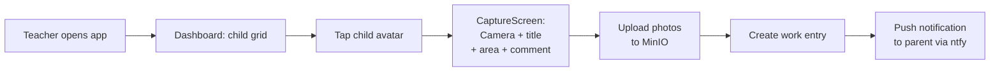
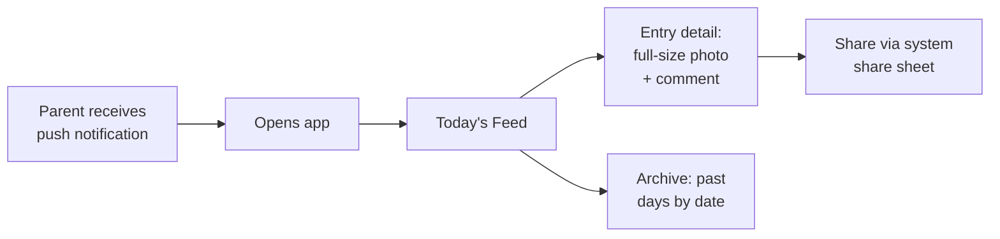
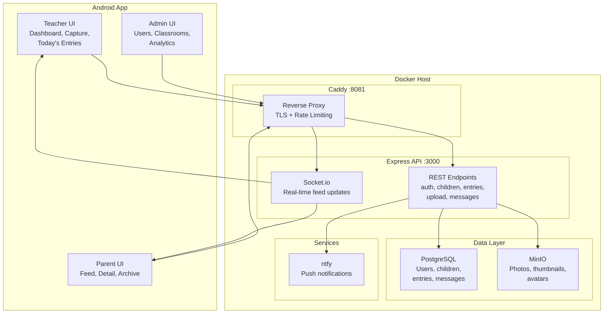
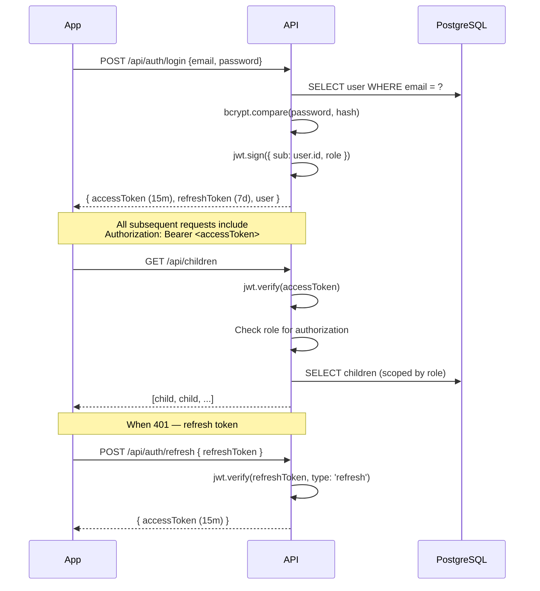
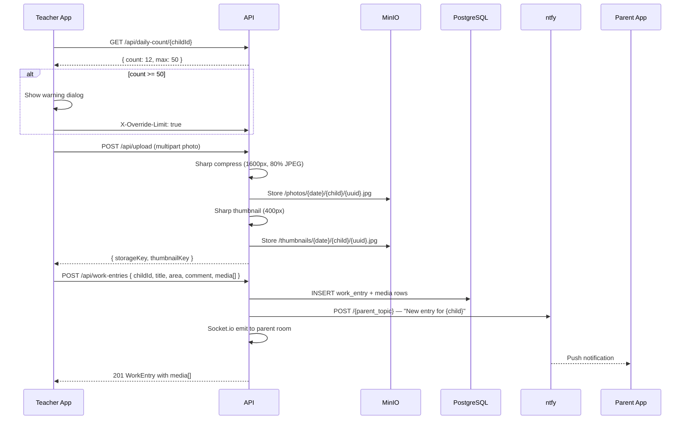

# Montessori Learning

Android app for Montessori preschools. Teachers capture children's daily work (photos + observations) and share instantly with parents via push notifications. Self-hosted, open source, zero monthly fees.

---

## Features

### 📸 Daily Work Capture
Teachers photograph each child's work — drawings, worksheets, practical life activities, art projects — and write a brief observation. Each capture takes ~30 seconds. Over a day, each child accumulates 2–5 entries forming a digital portfolio.



- CameraX integration with live preview
- Title, Montessori area picker (5 areas), teacher comment
- Multiple photos per entry (different angles / progress shots)
- Photo review — delete, reorder before submitting

### 👪 Parent Feed
Parents see a real-time chronological feed of their child's day with photos, area badges, and teacher observations.



- Daily summary card (X entries, Y photos today) with share button
- Archive with date picker for any past day
- Share single entry or daily summary via system share sheet

### 📨 Messaging
Teachers send announcements to individual parents, a classroom, or everyone. Read receipts included.

### 📊 Daily Limit (50 images/child/day)
Server-enforced limit with teacher override:
- `COUNT` query before each upload
- Warning dialog when approaching limit
- "Upload Anyway" with `X-Override-Limit` header

### 🔌 Offline Queue
Entries save to Room DB and sync when network returns via WorkManager.

### 🔔 Self-Hosted Push (ntfy)
No Google Play Services or Firebase required. Works on any Android device including Chinese tablets.

### 🛡️ Zero Monthly Cost
| Component | Cost |
|-----------|------|
| Server | Your hardware |
| Database (PostgreSQL) | $0 |
| File storage (MinIO) | $0 |
| Push notifications (ntfy) | $0 |
| SSL (Caddy + Let's Encrypt) | $0 |
| **Total** | **$10–20/mo (electricity)** |

---

## System Architecture



---

## Auth Flow



---

## Teacher Capture Flow



---

## Tech Stack

| Layer | Technology |
|-------|-----------|
| **Android UI** | Kotlin, Jetpack Compose, Material3 |
| **Camera** | CameraX |
| **DI** | Hilt |
| **Local DB** | Room (offline queue + cache) |
| **HTTP** | Retrofit + OkHttp |
| **Real-time** | Socket.io |
| **Backend** | Node.js + Express |
| **Database** | PostgreSQL 16 (Knex.js) |
| **File storage** | MinIO (S3-compatible) |
| **Image processing** | Sharp (resize + compress) |
| **Push** | ntfy (self-hosted, FCM-free) |
| **Auth** | JWT + bcryptjs |
| **Reverse proxy** | Caddy (auto TLS) |
| **Container** | Docker Compose |

---

## Quick Start

### 1. Start backend

```bash
docker compose up -d
```

This starts PostgreSQL, MinIO, ntfy, the Express API, and Caddy.

### 2. Verify

```bash
docker compose ps
```

### 3. Test login

```bash
# Teacher
curl -s http://localhost:3000/api/auth/login \
  -H "Content-Type: application/json" \
  -d '{"email":"teacher@demo.com","password":"password123"}'

# Parent
curl -s http://localhost:3000/api/auth/login \
  -H "Content-Type: application/json" \
  -d '{"email":"parent@demo.com","password":"password123"}'
```

### 4. Build Android app

```bash
export JAVA_HOME=~/jdk17/jdk-17.0.14+7
export PATH=$JAVA_HOME/bin:$PATH
cd app
./gradlew assembleDebug
# APK: app/build/outputs/apk/debug/app-debug.apk
```

---

## API Endpoints

| Method | Path | Auth | Description |
|--------|------|------|-------------|
| POST | /api/auth/register | No | Register (email, password, displayName) |
| POST | /api/auth/login | No | Login → JWT |
| POST | /api/auth/refresh | No | Refresh access token |
| GET | /api/classrooms | User | List classrooms |
| GET | /api/classrooms/:id | User | Classroom with children + teachers |
| POST | /api/classrooms | Admin | Create classroom (stub) |
| GET | /api/children | User | List children (role-scoped) |
| POST | /api/children | Teacher | Create child |
| GET | /api/work-entries | User | List entries (role-scoped) |
| POST | /api/work-entries | Teacher | Create entry with media refs |
| DELETE | /api/work-entries/:id | Teacher | Soft delete entry |
| POST | /api/upload | Teacher | Upload photo (multipart) |
| GET | /api/daily-counts | User | Photo counts per child (dashboard) |
| GET | /api/daily-count/:childId | User | Single child's count |
| GET | /api/daily-summary | Parent | Today's feed grouped by child |
| GET | /api/messages | User | List messages |
| POST | /api/messages | Teacher | Send message |
| PUT | /api/messages/:id/read | User | Mark message read |
| GET | /api/admin/analytics | Admin | Analytics (stub) |

---

## Test Accounts

| Role | Email | Password | Display Name |
|------|-------|----------|-------------|
| Teacher | teacher@demo.com | password123 | Maria Montessori |
| Parent | parent@demo.com | password123 | Anna Parent |
| Child | Luca Rossi (Sunshine Casa, DOB 2021-03-15) | — | — |

---

## Documentation

| File | Contents |
|------|----------|
| [ARCHITECTURE.md](ARCHITECTURE.md) | Data model, deployment, security, costs |
| [PLAN.md](PLAN.md) | Business rules, user stories |
| [TODO.md](TODO.md) | Phased task list |
| [AGENTS.md](AGENTS.md) | Build environment, session continuity |

---

## License

MIT
